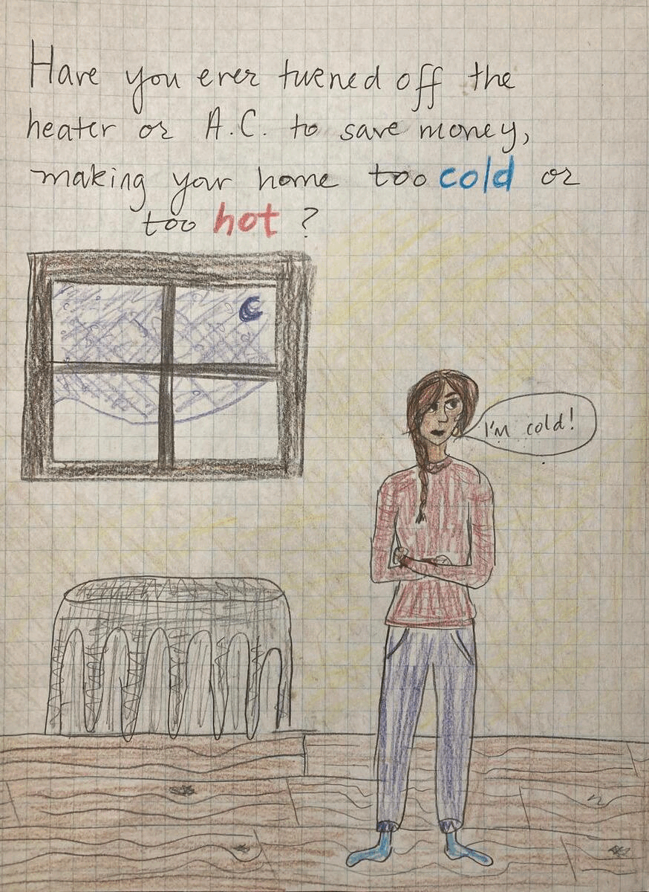

## Final Project: Part 1

#### Want to see more?</b> Check out [Part 2](Final_Project_Part2.md) and [Part 3](Final_Project_Part3.md) of the project! 

### Project Summary: 
In 2020, over 1 in 4 U.S. households experienced energy insecurity, a condition defined as “the inability to meet basic household energy needs” [(Hern&aacute;ndez, 2016)](https://www.ncbi.nlm.nih.gov/pmc/articles/PMC5114037/). Energy insecurity negatively impacts families’ health, and unsafe indoor temperatures are especially dangerous for elderly people and children [(McGeehin and Mirabelli, 2001)](https://ehp.niehs.nih.gov/doi/10.1289/ehp.109-1240665). There are also racial and ethnic dimensions to energy insecurity: studies have shown that Black and Hispanic households experience energy insecurity at higher rates [(Memmott, et al, 2021)](https://www.nature.com/articles/s41560-020-00763-9). In the face of climate change and increasing severe weather events, we need a strong energy policy system to protect vulnerable families from the negative health and social impacts associated with energy insecurity. 
 
### Project Structure: 
#### Set-Up: Establish the emotional stakes of energy insecurity 
I realize that, as a concept, energy security may be ambiguous, vague, and unfelt for most of my readers. So, in the set-up of the project, in addition to sharing the textbook definition of energy insecurity, I want to <b>establish the emotional stakes of energy insecurity</b> with either a story, quote, or image, framed with a nudge that makes the reader think about energy insecurity in their own life: have <em>they</em> ever turned off the heater or AC to save money, making their home too hot or too cold in the process? 

#### Conflict: The who, what, and where of energy insecurity 
Next, I want to show the reader the <b>who, what, and where of energy insecurity</b>: who experiences energy insecurity at the greatest rates, what causes energy insecurity, and where energy insecurity is concentrated. I will accomplish this through a series of charts, graphics, and maps, in addition to text description of the issues. I plan to include the following visualizations: 
<ul>
  <li>Unit chart showing that 27%, or roughly 1 in 4, households experience energy insecurity</li>
  <li>Map demonstrating where energy insecurity rates are highest across the country</li>
  <li>Chart showing how households cope in the face of energy insecurity</li>
  <li>Chart showcasing the increase in heat-related deaths</li>
</ul>
I hope that the chart on coping mechanisms will further elicit pathos from the reader and embody the issue further: thinking about someone skipping a meal so that they can keep the heat on makes the issue all the more tangible. In addition, I want to sow the seed that climate change will only exacerbate energy insecurity and for the most vulnerable populations, as this is a part of my call-to-action. 

<b>I also want to supplement the data with stories and quotes from individuals who have experienced energy insecurity themselves</b>. This is, after all, a data <em>story</em>, and the lived experiences of people who experience the issues is critical in crafting informed policy solutions. There is a wonderful researcher named [Diana Hern&aacute;ndez]( https://www.publichealth.columbia.edu/people/our-faculty/faculty-action/energy-insecurity) whose perspective, [work]( https://www.ncbi.nlm.nih.gov/pmc/articles/PMC5114037/), and [interviews]( https://www.healthaffairs.org/doi/10.1377/hlthaff.2017.1413) I would love to draw from in supplementing the visualizations. 

#### Resolution: Policy interventions 
At this stage, the reader will ideally have both an emotional connection to the topic, as well as a firmer grasp on what energy insecurity constitutes and who it impacts. With this established, I want to end with forward-thinking policy interventions, <b>reinforcing that energy insecurity is only likely to get worse in the future with climate change</b> – that is, establishing the <em>urgency</em> of the action. Some suggested solutions might include expansion of existing programs, such as the Low Income Home Energy Assistance Program and the Weatherization Assistance Program, as well as novel energy efficiency programs that are climate-resilient, targeted to low-income populations.  

## Sketches: 
<b>Sketch 1:</b> This sketch is of the very first screen I want to show viewers: a question prompt, paired with a scene, getting viewers to think about energy insecurity in their own life. After a few moments of reflection, a pop-up will appear introducing the concept of energy insecurity. In this sketch, I have hand-drawn a scene of a woman bundled up inside her apartment, with a wintry scene in the background and a radiator adjacent to her. These visual cues are meant to hint at the main elements of the story: weather/climate, heating/cooling facilities, and their impact on people. Since this is rather specific, I don't think I'll be able to find an open source image combining all of these elements. I anticipate that I'll have to draw another, cleaner version of this scene for the final collation in Shorthand.  

<b>Sketch 2:</b> This sketch is a unit chart showing how many people across the U.S. experience energy insecurity. Based on the feedback from the in-class critique session, I have added a title explicitly defining energy insecurity, instead of having the definition in text as I originally did. After building a bit of engagement with the first sketch, I want to start digging into the data, highlighting the fact that energy insecurity is a widespread phenomenon. A simple unit chart, using a relevant graphic, should make a nice way to transition into the stats.
## Energy insecurity is [“the inability to meet basic household energy needs”](https://www.ncbi.nlm.nih.gov/pmc/articles/PMC5114037/)

<b>Sketch 3:</b> Energy insecurity has important geographic dimensions: certain regions across the U.S. experience it at greater rates, and the ways that different regions of the country experience it vary. For example, households in Maine are more likely to face challenges in heating their homes during cold weather months, whereas households in Arizona are more likely to need cooling facilities. The map will allow viewers to scroll over high insecurity states to see what their rates and energy needs are. A text summary of overarching needs and trends will also be provided.
 

<b>Sketch 4:</b> This bubble chart depicts how households cope or are forced to cope with energy insecurity. Some reduce food consumption, while others are unable to use heating or cooling facilities. I would love to feature quotes from people with lived experience alongside this chart, to make these summary statistics more felt. 
 

<b>Sketch 5:</b> This image includes the header for a section ("Climate change deepens risks for the most vulnerable"). It also includes a line chart depicting the change in heat-related deaths over roughly the past three decades (the dataset ends in 2018). This chart will be a visual entry point into showing how climate change deepens energy insecurity risks, especially for the most vulnerable households and families.
 

<b>Sketch 6:</b> This final sketch is a mockup of my closing screen: a set of policy interventions that can decrease energy insecurity. In addition to clearly outlining the action items with icons, I also want to remind readers of the stakes of the issue, given increasing effects of climate change.   

## Data:
<b>I will source the bulk of my data from the U.S. Energy Information Administration (EIA), in particular from the Residential Energy Consumption Survey (RECS).</b> You can access the [landing page of the data here]( https://www.eia.gov/consumption/residential/data/2020/) and download the CSVs for years and topics of interest. While the EIA provides [data dating back to 1980](https://www.eia.gov/consumption/residential/data/previous.php), I anticipate that I will focus on more recent years, likely from 2000 onward. Importantly, the EIA did not begin explicitly tracking energy insecurity in RECS until 2015. Therefore, my ability to make temporal comparisons on energy insecurity is limited. However, I can comment on changes in types of fuels and levels of consumption over time, pieces of information which are tracked across survey years. 

In addition, I am interested in using the [2020 Household Energy Insecurity data]( https://view.officeapps.live.com/op/view.aspx?src=https%3A%2F%2Fwww.eia.gov%2Fconsumption%2Fresidential%2Fdata%2F2020%2Fhc%2Fxls%2FHC%252011.1.xlsx&wdOrigin=BROWSELINK) to make a variety of charts. In particular, I want to <b>break down the coping mechanisms that households engage in in the face of energy insecurity</b>. I think I could make engaging bubble chart here that offers a quick snapshot of how households are forced to cope with energy insecurity. I also could make regional energy insecurity map to highlight areas of the US that experience energy insecurity at higher rates. This has important policy implications in terms of identifying where the problem is greatest, as well as what solutions will be most effective (i.e., in the Southwest, a policy intervention focused on heating services is not likely to make a meaningful difference in energy insecurity, whereas one focused on cooling services would). 

To supplement the EIA data, I will also leverage data from the Environmental Protection Agency (CSVs available for download on each of the linked sites). In particular, I will use data from the agency's [climate change indicator data on health and society](https://www.epa.gov/climate-indicators/health-society). For my visualizations, I am considering the data [residential energy use ](https://www.epa.gov/climate-indicators/climate-change-indicators-heating-and-cooling-degree-days), [heat-related deaths](https://www.epa.gov/climate-indicators/climate-change-indicators-heat-related-deaths), [cold-related deaths](https://www.epa.gov/climate-indicators/climate-change-indicators-cold-related-deaths), and [the number of heating and cooling days per year across time](https://www.epa.gov/climate-indicators/climate-change-indicators-heating-and-cooling-degree-days). I am particularly interested in the heat-related death data from the EPA, as heat-related deaths have steadily increased over the past 30 years, which ties into the idea that climate change will exacerbate existing energy insecurity. 

## Method and Medium: 
<b>I will use Flourish, Tableau, and other packages (as needed) to create charts and graphics for the final project</b>. In addition to the visualizations, I will write a text narrative to guide readers through the project, providing content to enrich the visuals. For more complex charts, I will offer summaries and provide the required information for casual readers to quickly understand them. However, I will aim for simplicity in creating visualizations to make the project as accessible possible. Further, I am to avoid jargon and technical terms that would confuse casual readers – if I find myself needing to use technical language, I will explain terms upon first use. 

<b>To combine my charts, graphics, and text write-ups, I will use Shorthand</b>. I expect there may be some iteration in embedding Tableau and Flourish graphics to Shorthand – perhaps a chart’s aspect ratio will change upon upload – so I will budget time to work through potential hiccups. Shorthand’s capabilities are many – scrolling, zooming in, etc. – and I will explore these features to find a presentation flow that balances user engagement with navigability

## Feedback: 
During the critique on Tuesday, my group shared valuable feedback. <b>One member said that she wasn't sure at first what energy insecurity was, suggesting that the term be explicitly defined in simple terms.</b> To address this "high-value, high-feasibility" piece of feedback, I have pulled out the definition of energy insecurity into a header, highlighting the key terms. In future iterations of the project, I may consider modifying the definition to use hyper-accessible language, but in this version, I have simply maintained the Hern&aacute;ndez definition. 

Another member  mentioned that adding a time component to the visualization would show energy insecurity  has changed over time. This is a great point, and one I want to consider further in putting together the final project. However, at present I am currently constrained by the data that I have, as it only tracks energy insecurity from 2015 to 2020, limiting my ability to make temporal comparisons. So, this is a lower feasibility modification in the short term, but a valuable one for future drafts. 

 
<b>Finished?</b> Return to the [homepage of the repository.](README.md)

