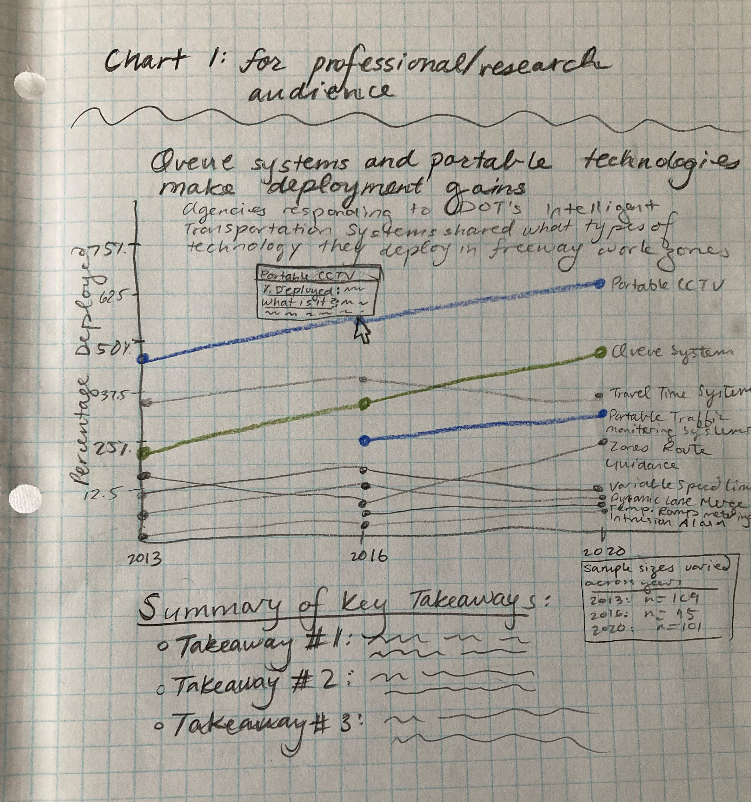
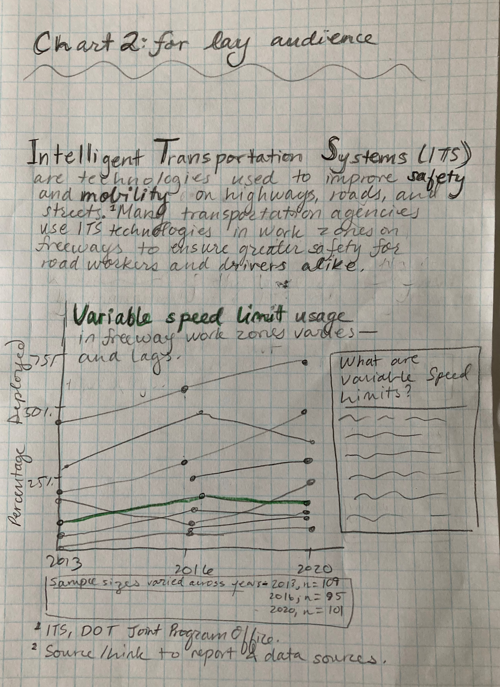

# Intelligent Transportation Systems Chart Redesign

You can access the original report from which I pulled the ITS work safety zone for freeway chart here: https://rosap.ntl.bts.gov/view/dot/60122. The chart of interest is on page 21 (PDF page 31) of the report. I have also included a screenshot of the original chart for quick reference below. You can reference the source data via the links below.

Underlying Data:
•	[2020](https://view.officeapps.live.com/op/view.aspx?src=https%3A%2F%2Fwww.itskrs.its.dot.gov%2Fsites%2Fdefault%2Ffiles%2Fdoc%2F2020_FM_data.xlsx&wdOrigin=BROWSELINK)
•	[2016](https://view.officeapps.live.com/op/view.aspx?src=https%3A%2F%2Fwww.itskrs.its.dot.gov%2Fsites%2Fdefault%2Ffiles%2Fdeployment-statistics%2Fdata%2F2016%2F2016_FM_data.xlsx&wdOrigin=BROWSELINK)
•	[2013](https://view.officeapps.live.com/op/view.aspx?src=https%3A%2F%2Fwww.itskrs.its.dot.gov%2Fsites%2Fdefault%2Ffiles%2Fdeployment-statistics%2Fdata%2F2013%2F2013_FM_data.xlsx&wdOrigin=BROWSELINK) 

 
 
 
 

 
 
 
 

