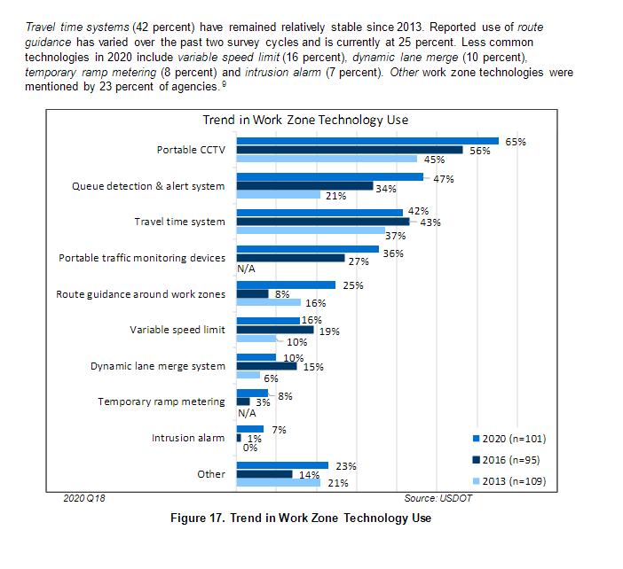

# Intelligent Transportation Systems Chart Redesign

You can access the original report from which I pulled the ITS work safety zone for freeway chart [here](https://rosap.ntl.bts.gov/view/dot/60122). The chart of interest is on page 21 (PDF page 31) of the report. I have also included a screenshot of the original chart for quick reference below. You can reference the source data via the links below.

Underlying Data: 
-[2020](https://view.officeapps.live.com/op/view.aspx?src=https%3A%2F%2Fwww.itskrs.its.dot.gov%2Fsites%2Fdefault%2Ffiles%2Fdoc%2F2020_FM_data.xlsx&wdOrigin=BROWSELINK)
 
-[2016](https://view.officeapps.live.com/op/view.aspx?src=https%3A%2F%2Fwww.itskrs.its.dot.gov%2Fsites%2Fdefault%2Ffiles%2Fdeployment-statistics%2Fdata%2F2016%2F2016_FM_data.xlsx&wdOrigin=BROWSELINK)
 
-[2013](https://view.officeapps.live.com/op/view.aspx?src=https%3A%2F%2Fwww.itskrs.its.dot.gov%2Fsites%2Fdefault%2Ffiles%2Fdeployment-statistics%2Fdata%2F2013%2F2013_FM_data.xlsx&wdOrigin=BROWSELINK) 

 
 
 
 

<noscript></noscript><object class='tableauViz'  style='display:none;'><param name='host_url' value='https%3A%2F%2Fpublic.tableau.com%2F' /> <param name='embed_code_version' value='3' /> <param name='site_root' value='' /><param name='name' value='TechnicalAudience&#47;TechAudience' /><param name='tabs' value='no' /><param name='toolbar' value='yes' /><param name='static_image' value='https:&#47;&#47;public.tableau.com&#47;static&#47;images&#47;Te&#47;TechnicalAudience&#47;TechAudience&#47;1.png' /> <param name='animate_transition' value='yes' /><param name='display_static_image' value='yes' /><param name='display_spinner' value='yes' /><param name='display_overlay' value='yes' /><param name='display_count' value='yes' /><param name='language' value='en-US' /><param name='filter' value='publish=yes' /></object>
                

<noscript></noscript><object class='tableauViz'  style='display:none;'><param name='host_url' value='https%3A%2F%2Fpublic.tableau.com%2F' /> <param name='embed_code_version' value='3' /> <param name='site_root' value='' /><param name='name' value='TechnicalAudience&#47;TechAudience' /><param name='tabs' value='no' /><param name='toolbar' value='yes' /><param name='static_image' value='https:&#47;&#47;public.tableau.com&#47;static&#47;images&#47;Te&#47;TechnicalAudience&#47;TechAudience&#47;1.png' /> <param name='animate_transition' value='yes' /><param name='display_static_image' value='yes' /><param name='display_spinner' value='yes' /><param name='display_overlay' value='yes' /><param name='display_count' value='yes' /><param name='language' value='en-US' /><param name='filter' value='publish=yes' /></object>

                

